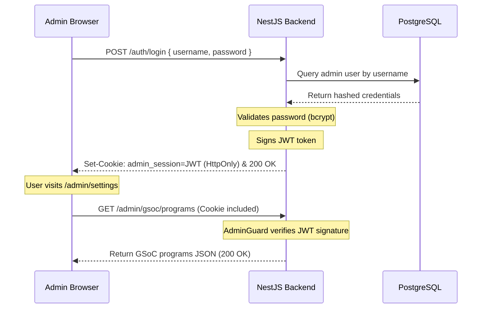
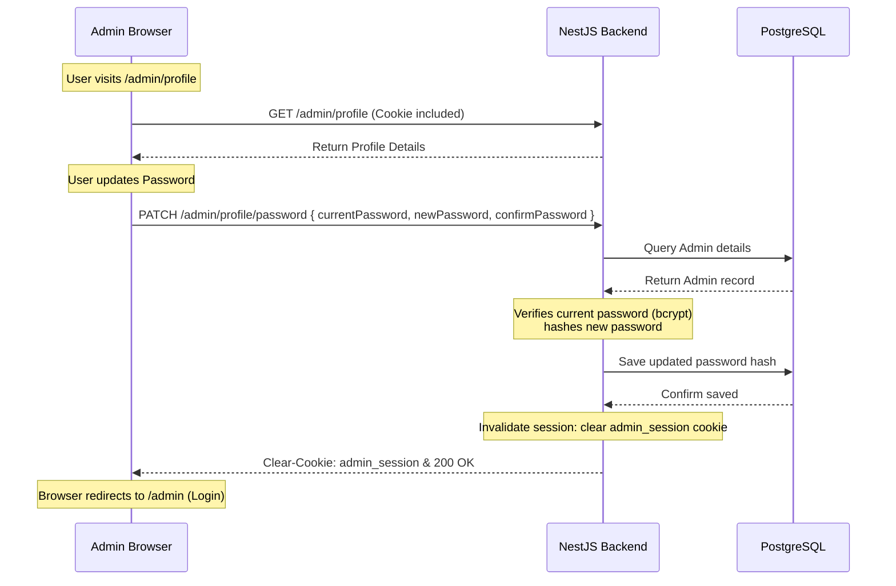
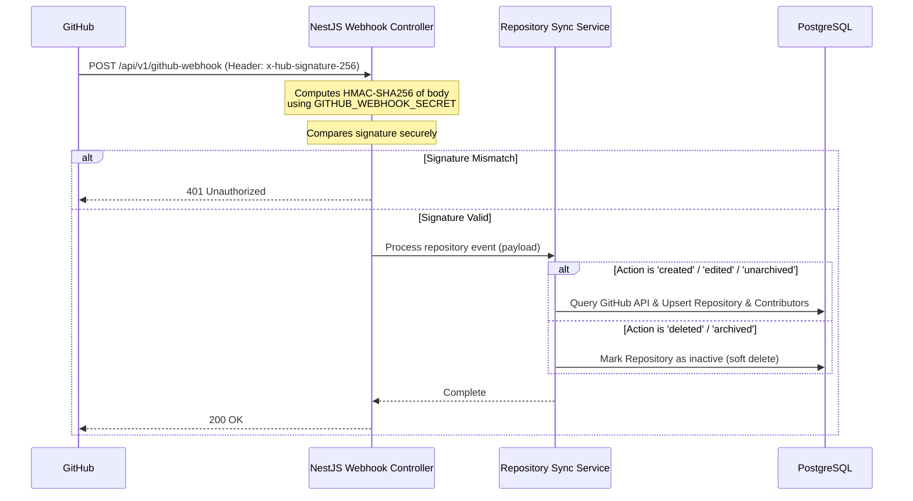

# WebiU 2.0 — Architecture & Code Structure

This document describes the high-level architecture, module design, data models, and deployment configurations of WebiU 2.0. It is written to be accessible to beginners while providing complete technical specifications for experienced developers.

---

## 1. High-Level Architecture Overview

WebiU 2.0 acts as a persistent database-backed aggregator and proxy for the **GitHub API (`api.github.com`)**. 

### How WebiU Interacts with GitHub
Instead of querying GitHub directly on every user action (which leads to slow page loads and rapid API rate limit exhaustion), WebiU employs a hybrid persistence-and-proxy model:

1. **Persistent Catalog**: Organization repositories, basic metrics (stars, forks), and the contributor leaderboard are stored in a local **PostgreSQL** database.
2. **Synchronization Events**: The database is kept in sync in real-time via **GitHub Webhooks** listening for repository modifications (creation, deletion, archiving, edits).
3. **Background Recovery (Drift Alignment)**: A background **Reconciliation Scheduler** cron job executes every 12 hours, querying `api.github.com` to scan for any changes missed during downtime.
4. **Live Cached Proxy**: For highly dynamic, individual user queries (like contributor issue/PR details, repository languages, and insights stats), the backend fetches data directly from `api.github.com` in real-time, caching responses locally for 5 minutes (`Cache-Control: public, max-age=300`) to guarantee high speed and efficiency.

### System Architecture Diagram

```
┌──────────────────┐         REST API (JSON)      ┌──────────────────┐
│                  │  ─────────────────────────►  │                  │
│   Angular 17+    │  http://localhost:5050       │     NestJS       │
│   Frontend       │  ◄─────────────────────────  │     Backend      │
│   (Port 4200)    │  (admin cookies included)    │     (Port 5050)  │
└──────────────────┘                              └────┬──────────┬──┘
                                                       │          │
                                            GitHub API │          │ TypeORM
                                            (Axios)    ▼          ▼
                                               ┌──────────────┐ ┌──────────────┐
                                               │api.github.com│ │  PostgreSQL  │
                                               │ (c2siorg org)│ │   Database   │
                                               └──────┬───────┘ └──────────────┘
                                                      │
                                                      │ GitHub Org Events
                                                      ▼ (HMAC Signature Verified)
                                               ┌──────────────┐
                                               │  Webhook     │
                                               │  Receiver    │
                                               └──────────────┘
```

---

## 2. Directory Structure & Layout

A breakdown of the project layout, highlighting all major source folders and configuration files:

```
Webiu/
├── webiu-ui/                          # Angular standalone application
│   ├── src/
│   │   ├── app/
│   │   │   ├── components/            # Reusable components (navbar, cards)
│   │   │   ├── page/                  # Route-level pages (homepage, admin-settings, gsoc)
│   │   │   ├── services/              # Angular services (GSoC CMS, theming, cache)
│   │   │   ├── common/                # Shared utilities & configurations
│   │   │   ├── shared/                # Common UI elements (loading spinner)
│   │   │   ├── app.routes.ts          # Route definitions
│   │   │   ├── app.config.ts          # Angular application configuration
│   │   │   └── app.component.ts       # Root UI template
│   │   ├── assets/                    # Images, icons, static files
│   │   ├── environments/              # Environment configurations (dev, prod)
│   │   └── styles.scss                # Global stylesheet (themes, colors)
│   ├── Dockerfile                     # Frontend containerization
│   ├── nginx.conf                     # Nginx static deployment routing rule
│   └── package.json                   # UI build dependencies
│
├── webiu-server/                      # NestJS REST backend
│   ├── src/
│   │   ├── auth/                      # JWT authentication & HttpOnly cookies
│   │   ├── database/                  # PostgreSQL entity models & migrations
│   │   ├── github/                    # GitHub REST client service
│   │   ├── github-webhook/            # Webhook signature validation & handler
│   │   ├── gsoc/                      # GSoC CMS (programs, ideas, mentors)
│   │   ├── system-setting/            # Runtime configurations
│   │   ├── project/                   # Repository listing & sync logic
│   │   ├── contributor/               # Contributor stats & leaderboards
│   │   ├── common/                    # Shared utilities & cache provider
│   │   ├── app.module.ts              # Root backend NestJS module
│   │   └── main.ts                    # Backend entrypoint file
│   ├── Dockerfile                     # Backend containerization
│   ├── .env.example                   # Env variable reference templates
│   └── package.json                   # Server build dependencies
│
├── docs/                              # Project guides & resources
│   ├── ARCHITECTURE.md                # This file (high-level layouts & flows)
│   ├── API_DOCUMENTATION.md           # REST API specification reference
│   ├── CONTRIBUTING.md                # Developer contribution rules
│   └── webiu.postman_collection.json  # Pre-configured requests for local testing
│
├── docker-compose.yml                 # Multi-container local deployment
└── README.md                          # Root README file
```

---

## 3. Data Models & Entity Relationships

We use **TypeORM** to manage our schemas. Below is a diagram showing how our persistent models are linked together in the PostgreSQL database:

```mermaid
erDiagram
    ADMIN {
        uuid id PK
        string username
        string passwordHash
        date createdAt
        date updatedAt
        date lastLoginAt
    }
    SYSTEM_SETTINGS {
        string key PK
        string value
    }
    REPOSITORY {
        uuid id PK
        string githubRepoId
        string name
        string description
        string homepage
        string topics
        int stars
        int forks
        boolean isActive
        string syncStatus
        string syncError
        string reconciliationSource
        date lastSyncedAt
        date lastWebhookAt
        date lastReconciliationAt
    }
    CONTRIBUTOR {
        uuid id PK
        string githubUserId
        string username
        string displayName
        string avatarUrl
        string profileUrl
        string bio
    }
    REPOSITORY_CONTRIBUTOR {
        uuid id PK
        uuid repositoryId FK
        uuid contributorId FK
        int contributionCount
    }
    GSOC_PROGRAM {
        uuid id PK
        int year
        string title
        string description
        string heroImageUrl
        string introHtml
        string slackUrl
        string proposalTemplateUrl
        string githubOrgUrl
        string status
        boolean isActive
    }
    GSOC_IDEA {
        uuid id PK
        uuid programId FK
        int projectNumber
        string title
        string explanation
        string expectedResults
        string prerequisites
        string difficulty
        int durationHours
        string slackChannel
        string githubUrl
        string status
        int displayOrder
    }
    GSOC_MENTOR {
        uuid id PK
        string name
        string githubHandle
    }
    GSOC_IDEA_MENTORS {
        uuid ideaId FK
        uuid mentorId FK
    }

    REPOSITORY ||--o{ REPOSITORY_CONTRIBUTOR : has
    CONTRIBUTOR ||--o{ REPOSITORY_CONTRIBUTOR : makes
    GSOC_PROGRAM ||--o{ GSOC_IDEA : contains
    GSOC_IDEA }o--o{ GSOC_MENTOR : managed_by
```



---

## 4. Key Architectural Flows

### A. Administrator Authentication & Session Flow
We removed social OAuth flows to ensure administrative credentials are isolated and self-hosted. 

Admin login uses credentials validated against the `admins` table. Upon success, a signed JWT is returned in an **HttpOnly, SameSite=Lax** session cookie named `admin_session`. The browser automatically includes this cookie in subsequent API requests.



### B. Admin Profile & Session Invalidation Flow
Administrators can update their username or password. To ensure high security, any change to these credentials immediately invalidates all active sessions by clearing the HttpOnly session cookie (`admin_session`), forcing the user to log in again.



---

### C. GitHub Webhook Ingest Flow
When a repository is modified on GitHub (e.g. created, edited, renamed, archived, or deleted), GitHub pushes a webhook event to our server. 

We verify the event source using a secure token payload hash check (`HMAC-SHA256`) before committing any changes to the database.



---

### D. Background Reconciliation & Drift Recovery
If the server is down or a webhook delivery fails, database "drift" can occur. To recover from this, a background NestJS scheduler cron job executes every 12 hours.

The cron job:
1. Downloads the full repository list from GitHub.
2. Compares properties (stars, forks, description, topics, archiving) with PostgreSQL records.
3. Synchronizes drifted properties and upserts missing records.
4. Identifies repositories in PostgreSQL that no longer exist on GitHub and deactivates them.

---

### E. Dynamic Configuration & System Settings
Instead of hardcoding details like the active year or site metadata, settings are stored in the database. 

The backend bootstrap phase seeds default keys. An admin can edit these keys dynamically from the admin panel, updating the site settings in real-time without server restarts or code updates.

Supported keys include:
* `gsoc.current_year`: Configures the public GSoC program view.
* `gsoc.show_ideas_page`: Globally toggles project ideas visibility.
* `gsoc.registration_open`: Shows/hides GSoC registration.
* `site.title` & `site.description`: Configures layout SEO headers.
* `site.maintenance_mode`: Toggles a public-facing holding screen.

---

## 5. Deployment Architectures

### A. Backend Deployment (Render.com)
The backend container runs on Render as a Web Service.
* **Working Directory Context**: Set `Root Directory` in Render to `webiu-server`. This ensures commands run inside the NestJS project folder.
* **Build Command**: `npm install && npm run build`
* **Start Command**: `npm run start:prod`
* **Health Checks**: Configure the Render health check path to `/health`. Render polls this during builds and only redirects user traffic once a `200 OK` response is received.
* **Database Connection**: Ensure `DATABASE_SSL=true` is set on Render to support encrypted database connections.

### B. Frontend Deployment (GitHub Pages)
The frontend is compiled into static HTML/CSS/JS files and hosted on GitHub Pages.
* **Build Action**: Built using `npx ng build --configuration production --base-href=/Webiu/`.
* **SPA Routing Fallback (`404.html`)**:
  * Since GitHub Pages is a static file server, refreshing or directly entering a deep subroute (like `/projects` or `/admin`) returns a `404 Not Found` page instead of routing it to Angular.
  * **Solution**: Our build workflow copies `index.html` to `404.html` in the build output (`cp dist/webiu/browser/index.html dist/webiu/browser/404.html`).
  * When GitHub Pages encounters a subroute refresh, it serves `404.html`. The browser loads the Angular bundle, reads the URL path, and resolves the correct client component dynamically.